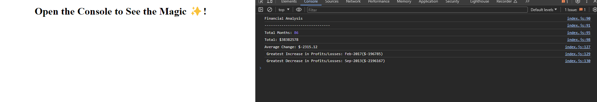

# Console-finances

This challenge was to create a JavaScript program that displays financial data within an array and then breaks pulls out certain numbers.calulations that were required ie Average change, Maximum increase and decrease,

Working Application image

